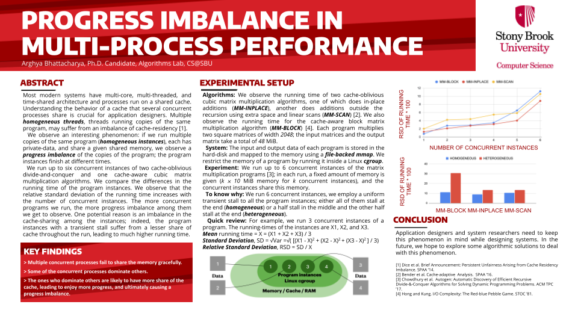

# Multiprocess_Performance
[Here](https://www3.cs.stonybrook.edu/~grd/posters/GRD_2021_Poster_Arghya_Bhattacharya.pdf) is my published research in [Graduate Research Day, CS@SBU, 2021](https://www3.cs.stonybrook.edu/~grd/index.html) on how an algorithm's performance degrades as number of concurrent processes increase in an multi-process environment.
```bash
sudo ./mm_parallel_instance.sh
```
## To know why there is a progress imbalance while running multiple concurrent processes: cache-imbalance is the culprit
```bash
sudo ./mm_parallel_instance_cache_imbalance.sh
```
## Poster Presentation in Graduate research Day 2021 of CS@SBU
